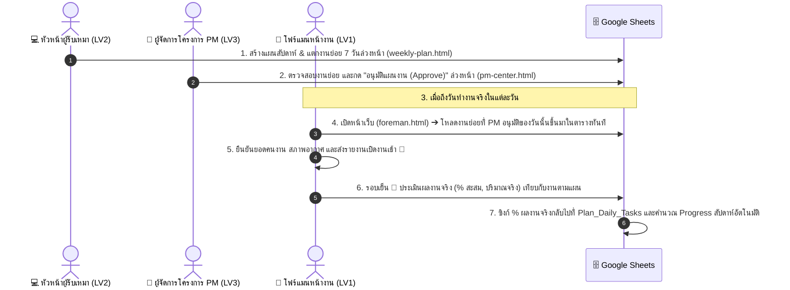

# Walkthrough: ระบบแยกไฟล์ HTML ตามระดับ (LV1 / LV2 / LV3) และการล็อกที่มาของงานต้องมาจากแผนที่ PM อนุมัติล่วงหน้า

ระบบได้รับการปรับโครงสร้างตามคำสั่งของคุณอย่างสมบูรณ์แบบ:
1. **แยกหน้า Path เป็นไฟล์ `.html` แต่ละบทบาทอย่างเด็ดขาด**
2. **ล็อกที่มาของงาน (Task Lineage Rule)**: รายการงานในแต่ละวันของโฟร์แมน **ต้องมาจากแผนงานที่หัวหน้าผู้รับเหมาเป็นคนสร้างขึ้นมาและถูก PM อนุมัติล่วงหน้ามาแล้วเท่านั้น**
3. **ปรับแต่ง UX/UI ตามอุปกรณ์เป้าหมาย**:
   - `foreman.html` ➔ **เน้นหน้าจอมือถือ (Mobile-First)**
   - `weekly-plan.html` ➔ **เน้นหน้าจอคอมพิวเตอร์ (Desktop-Wide)**
   - `pm-center.html` ➔ **เน้นหน้าจอคอมพิวเตอร์ (Executive Dashboard มี Gantt Chart + คลังรายงานย้อนหลัง)**
   - `index.html` ➔ **ประตูทางเข้าหลัก & Smart Auto-Router**

---

## 📁 1. แผนผังไฟล์ HTML ที่แยกอิสระ

| ไฟล์ (Path) | ระดับ (Level) | หน้าที่หลัก | ขนาดหน้าจอ (Target UX) |
|---|---|---|---|
| [`foreman.html`](file:///c:/Users/Admin/Desktop/Projectmanager_site/foreman.html) | **LV1: โฟร์แมน** | • โหลดงานย่อยที่ PM อนุมัติมาเป็นเป้าหมายวันนั้นอัตโนมัติ • รายงานเปิดงานเช้า 🌅 (คนงาน, อากาศ, Safety Talk) • รายงานสรุปจบงาน 🌆 (ประเมิน % จริง, ปริมาณจริง, รูปถ่าย) | **📱 มือถือ (Mobile Frame)** `max-width: 500px;` ไม่มีเมนูของระดับอื่น |
| [`weekly-plan.html`](file:///c:/Users/Admin/Desktop/Projectmanager_site/weekly-plan.html) | **LV2: หัวหน้าผู้รับเหมา** | • **ตาราง Gantt แบบ Interactive (ลากปรับกราฟตามวัน)**: เพิ่มงานหลักแล้วลากแท่งกราฟ หรือลากขอบซ้าย/ขวาเพื่อกำหนดวันเริ่มต้น-สิ้นสุดได้อย่างอิสระ • **แตกงานย่อย (Subtasks) ใต้รายการหลัก**: **งานย่อยจะไม่ลงวันที่ล่วงหน้า** แต่จะเป็นไปตามที่โฟร์แมนทำได้จริงหน้างานในแต่ละวัน • ตัวเลื่อนดูสัปดาห์ (Week Stepper) พร้อมสรุป KPI และส่ง PM อนุมัติ | **💻 หน้าจอคอม (Desktop-Wide)** `max-width: 1440px;` ตาราง Gantt 7 วันแบบ Interactive |
| [`pm-center.html`](file:///c:/Users/Admin/Desktop/Projectmanager_site/pm-center.html) | **LV3: ผู้จัดการโครงการ PM** | • **ศูนย์อนุมัติแผนงาน**: ตรวจสอบงานย่อย, ให้ข้อคิดเห็น, สั่ง Approve หรือ Revision • **แผนภูมิ Gantt ไทม์ไลน์**: กราฟแท่งความคืบหน้าภาพรวมโครงการ • **คลังรายงานย้อนหลัง**: ค้นหา/กรองรายงานทุกไซต์งาน พร้อมดูภาพถ่าย | **🖥️ หน้าจอคอม (Executive Dashboard)** `max-width: 1400px;` 3 แท็บเฉพาะสำหรับ PM |
| [`index.html`](file:///c:/Users/Admin/Desktop/Projectmanager_site/index.html) | **Portal & Router** | • **Smart Auto-Router**: ส่งต่อผู้ใช้ไปยังหน้าของตัวเองทันทีเมื่อมี `?lv=1`, `?lv=2`, หรือ `?lv=3` • **Role Portal**: แสดงการ์ด 3 บทบาทขนาดใหญ่ ให้ผู้ใช้เลือกเข้าสู่ระบบ | **🌐 รองรับทุกอุปกรณ์** |

---

## 🔄 2. ขั้นตอนการทำงานจริงตามกฎเหล็ก (End-to-End Workflow)

### รายละเอียดการทำงานของโฟร์แมน (`foreman.html`):
- เมื่อโฟร์แมนเปิดหน้าเว็บ ระบบจะตรวจสอบวันที่ (`reportDate`) และเรียก `fetchApprovedTasksForDate` ทันที
- **กรณีมีงานที่ PM อนุมัติไว้**:
  - จะแสดงแบนเนอร์สีเขียว: `🎯 มี X รายการงานตามแผนที่ได้รับอนุมัติจาก PM วันนี้`
  - ตารางงานจะถูกกรอกข้อมูลอัตโนมัติ: ชื่องานตามแผน, โซนพื้นที่, ปริมาณเป้าหมาย, และบริษัทผู้รับเหมา โดยมีป้ายกำกับ `🎯 ตามแผน: [ชื่อบริษัท]`
- **กรณีวันนั้นยังไม่มีงานที่ PM อนุมัติ**:
  - จะแสดงกล่องเตือนสีเหลือง: `⚠️ ยังไม่มีแผนงานที่ได้รับการอนุมัติจาก PM สำหรับวันนี้ (โปรดรอหัวหน้าผู้รับเหมายื่นแผน และ PM อนุมัติ)`
  - โฟร์แมนไม่สามารถมั่วนึกงานเองได้ แต่มีปุ่มตัวเลือกเสริมกรณีฉุกเฉิน: *"⚠️ มีงานฉุกเฉินนอกแผนที่ต้องทำเพิ่ม? กดที่นี่"* ซึ่งจะมีป้ายกำกับชัดเจนว่า `⚡ นอกแผน`

---

## 👔 3. แดชบอร์ดสำหรับ PM (`pm-center.html`)

1. **แท็บที่ 1: ศูนย์อนุมัติแผนงาน**:
   - แสดงแผนสัปดาห์ของผู้รับเหมาทุกราย พร้อมป้ายตัวเลขสีแดงแจ้งเตือนแผนที่รออนุมัติ
   - ปุ่ม `🔍 ตรวจสอบงานย่อย 7 วัน` กางตารางตรวจสอบรายวันก่อนอนุมัติ
   - ช่องข้อสั่งการ และปุ่ม `✅ อนุมัติแผนงาน (Approve)` / `⚠️ สั่งปรับปรุง (Revision)`
2. **แท็บที่ 2: แผนภูมิ Gantt ไทม์ไลน์**:
   - แสดงไทม์ไลน์สัปดาห์ในรูปแบบ Gantt Bar สีเขียว/เหลือง/แดง
   - มีแถบ Progress % วิ่งตามความคืบหน้าจริงที่โฟร์แมนรายงานเข้ามา
   - สามารถคลิกที่แท่ง Gantt เพื่อเปิดดูรายละเอียดงานย่อยได้ทันที
3. **แท็บที่ 3: คลังรายงานประจำวันย้อนหลัง**:
   - ค้นหาและกรองรายงานตามกะ (เช้า/เย็น), ชื่อโฟร์แมน, วันที่, บริษัท
   - ปุ่ม `🔍 เปิดดู` แสดง Pop-up รายงานฉบับเต็ม พร้อมรูปถ่ายหน้างานความละเอียดสูง

---

## 🌐 4. ลิงก์ทดสอบระบบที่เปิดใช้งานได้ทันที

- **หน้าหลัก (Portal & Smart Router)**:  
  👉 [http://localhost:8080/index.html](http://localhost:8080/index.html)
- **LV1 โฟร์แมน (Mobile-First)**:  
  👉 [http://localhost:8080/foreman.html](http://localhost:8080/foreman.html)
- **LV2 หัวหน้าผู้รับเหมา (Desktop-Wide)**:  
  👉 [http://localhost:8080/weekly-plan.html](http://localhost:8080/weekly-plan.html)
- **LV3 ผู้จัดการโครงการ PM (Executive Dashboard)**:  
  👉 [http://localhost:8080/pm-center.html](http://localhost:8080/pm-center.html)

*(ทุกหน้าจะมีแถบ **Top Role Switcher** ด้านบนสุด เพื่อให้คุณคลิกสลับหน้าระหว่างบทบาทได้อย่างรวดเร็วในคลิกเดียว)*

---

## 📑 5. ระบบออกเอกสาร Daily Report PDF & พิมพ์รายงานสำหรับ PM (อัปเดตล่าสุด)

ระบบสร้างและพิมพ์เอกสารรายงานประจำวันหน้างานมาตรฐานวิศวกรรมก่อสร้าง (Construction Daily Site Report) ได้รับการติดตั้งลงในหน้า PM Center (`pm-center.html`) เรียบร้อยแล้ว:

### 🌟 ฟังก์ชันหลัก
1. **ดาวน์โหลดเป็นไฟล์ PDF (ขนาด A4 คมชัดสูง)**:
   - สั่งสร้างและดาวน์โหลดไฟล์ `Daily_Report_{ReportID}_{Date}.pdf` ได้ใน 1 คลิก
   - ใช้ไลบรารี `html2pdf.js` พร้อมระบบ Auto-fallback ไปที่ Browser Print Preview หากอุปกรณ์มีข้อจำกัดด้าน CORS รูปภาพ
2. **พิมพ์เอกสารผ่าน Browser Print Dialog (`🖨️ พิมพ์`)**:
   - เปิดหน้าต่างพิมพ์เอกสารพร้อมตั้งค่า `@page { size: A4 portrait; margin: 10mm; }` และ `-webkit-print-color-adjust: exact;` ให้ตัวหนังสือและแถบสีกราฟิกคมชัดสมบูรณ์แบบ
3. **จัดเลย์เอาต์ตามแบบฟอร์มรายงานก่อสร้างไทยมาตรฐาน**:
   - **Header**: ตราสัญลักษณ์, รหัสโครงการ, ชื่อโครงการ, รหัสรายงาน, วันที่ (แปลงเป็นพุทธศักราช เช่น 21 กันยายน 2569), รอบกะ (รอบเช้า 🌅 / จบงาน 🌆)
   - **Weather & Rain Delay**: สภาพอากาศ, ชั่วโมงฝนตกหยุดงาน
   - **Workforce Summary Table**: จำแนกโฟร์แมน, ช่างฝีมือ, แรงงานทั่วไป, จป.ความปลอดภัย, และยอดรวมกำลังพลทั้งหมด
   - **Task Progress Table**: รายการงานที่ปฏิบัติ, ความคืบหน้า (มี Progress Bar สวยงาม), ปริมาณงานที่ทำได้
   - **Machinery & Equipment**: รายการเครื่องจักรและยานพาหนะที่เข้าทำงาน
   - **Issues & Observations**: ปัญหา อุปสรรค และข้อสั่งการด้านความปลอดภัย
   - **Site Photos Grid**: ภาพถ่ายหน้างานพร้อมกรอบและคำบรรยาย
   - **Formal Signatures Block**: ช่องลงนามกำกับ 2 ฝ่ายอย่างเป็นทางการ:
     - ผู้รายงาน / โฟร์แมนหน้างาน (Site Supervisor / Foreman)
     - ผู้ตรวจรับ / ผู้จัดการโครงการ (Project Manager / PM)

### 🚀 จุดเข้าใช้งานในหน้า PM Center:
- **บนการ์ดรายงานแต่ละใบ (คลังรายงานย้อนหลัง)**:
  - ปุ่ม `🔍 ดูฉบับเต็ม`
  - ปุ่มด่วน `📄 PDF` (ดาวน์โหลดทันทีโดยไม่ต้องเปิด Pop-up)
  - ปุ่มด่วน `🖨️ พิมพ์` (สั่งพิมพ์ทันที)
- **ภายในหน้าต่าง Pop-up รายละเอียดรายงานฉบับเต็ม (`#modal-report-details`)**:
  - ปุ่ม `📥 ดาวน์โหลด PDF (A4)`
  - ปุ่ม `🖨️ พิมพ์เอกสาร`

---

## 🔒 6. การปรับปรุงระบบวงจรการอนุมัติและแจ้งเตือนก่อนปิดแผนงาน (Approval Flow & Exit Confirmation)

อัปเดตแก้ไขระบบ 3 จุดตามคำสั่งใช้งานจริง:

### 1. หน้า PM Center (`pm-center.html`) - ระบบสถานะการอนุมัติแบบ Dynamic:
- **ซ่อนปุ่มอนุมัติซ้ำเมื่ออนุมัติแล้ว**: เมื่องานถูกเปลี่ยนสถานะเป็น `Approved` ปุ่ม "✅ อนุมัติแผนงานประจำเดือน" จะถูกซ่อนทันที
- **แสดงกล่องสถานะสีเขียว (Approved Banner)**: แสดงชัดเจนว่า *"แผนงานนี้ได้รับการอนุมัติเรียบร้อยแล้ว (Approved) พร้อมให้โฟร์แมนดึงไปปฏิบัติงานหน้างาน"* พร้อมชื่อ PM และวันเวลาที่อนุมัติ
- **Optimistic State Update**: ทันทีที่กดอนุมัติ ระบบจะเปลี่ยนสีการ์ด ป้ายสถานะ และตัวนับ KPI บนหน้าจอทันที ไม่ต้องรอนาน
- **ตัวเลือกเสริม Revision**: หาก PM ต้องการส่งกลับให้แก้ไขภายหลัง สามารถกดปุ่ม `⚠️ สั่งปรับปรุงแผน (Revision)` พร้อมระบุเหตุผลได้เสมอ

### 2. หน้าโฟร์แมน (`foreman.html`) - ดึงงานที่ PM อนุมัติขึ้นตารางงานเช้าทันที:
- **แก้ไข Parameter Mapping**: แก้ไขการเรียก `gasService.fetchApprovedTasksForDate` ให้ส่งทั้ง `date`, `company` ของโฟร์แมน, และ `projectId` อย่างถูกต้อง
- **อัปเดต Backend GAS (`get_approved_tasks_for_date`)**: รองรับการจับคู่ข้ามชื่อบริษัทแบบยืดหยุ่น และกรองตามรหัสโครงการ ทำให้เมื่อ PM อนุมัติแผนงานของเดือน/สัปดาห์นั้น งานย่อยจะโหลดขึ้นตารางเปิดงานเช้าของโฟร์แมนทันที พร้อมแบนเนอร์สีเขียว `🎯 มี X รายการงานตามแผนที่ได้รับอนุมัติจาก PM วันนี้`

### 3. หน้าหัวหน้าผู้รับเหมา (`weekly-plan.html`) - กล่องยืนยันก่อนปิดหน้าวางแผน:
- **ปุ่ม `✕ ปิดหน้าต่าง` ในแถบ Header**: เพิ่มปุ่มสีแดงเด่นชัดข้างปุ่มซิงก์ชีต
- **ระบบตรวจจับการเปลี่ยนแปลง (`state.isDirty`)**: หากมีการขยับ Gantt Bar, เพิ่มงานหลัก, แตกงานย่อย, หรือแก้ไขเป้าหมาย Milestone ระบบจะบันทึกสถานะว่ามีการเปลี่ยนแปลง
- **กล่องยืนยันก่อนปิด (`#modal-confirm-exit`)**: เมื่อผู้ใช้กดปิด หรือพยายามออกจากหน้าขณะที่มีการแก้ไข จะแสดงคำถาม:
  > *"คุณมีการแก้ไขแผนงานที่ยังไม่ได้ส่งอนุมัติ ต้องการส่งแผนงานนี้ให้ PM พิจารณาอนุมัติเลยหรือไม่? หรือต้องการปิดออกไปโดยไม่บันทึกข้อมูล?"*
  - 🚀 **ส่งแผนให้ PM อนุมัติทันที**: นำข้อมูลงานทั้งหมดส่งตรงเข้า Google Sheets ให้ PM พิจารณา
  - ❌ **ปิดไปเลยแบบไม่เซฟ (ไม่บันทึก)**: ยกเลิกการแก้ไขและพากลับสู่หน้าหลัก `index.html`
  - ↩️ **ยกเลิก (แก้ไขแผนงานต่อ)**: ปิดกล่องข้อความและอยู่ทำงานต่อในหน้าเดิม

---

## 🌆 7. ระบบเปรียบเทียบผลงานตอนปิดงาน (Evening Shift Task Comparison Cards)

- **การ์ดเปรียบเทียบ เช้า (เป้าหมาย) vs เย็น (ผลจริง)**:
  - ฝั่งซ้าย: แสดงเป้าหมายที่ตั้งไว้ตอนเช้า (ปริมาณ + % ความคืบหน้า)
  - ฝั่งขวา: ช่องกรอกปริมาณงานที่ทำได้จริง พร้อมปุ่ม Quick Pills (+25%, +50%, +75%, 100%)
  - แถบ Progress Bar คู่: ส้ม (เป้าเช้า) vs เขียว (ผลจริงเย็น)
  - ป้ายประเมินผลอัตโนมัติ: `📈 เกินเป้า`, `✅ ตามเป้า`, `⚠️ ต่ำกว่าเป้า`
- **การแยกรูปภาพหน้างาน**:
  - ตอนเช้า: ภาพแถวเปิดงาน / Safety Talk
  - ตอนเย็น: ภาพถ่ายหน้างานจริงตอนปิดงาน + แกลเลอรีพรีวิวภาพเช้าแบบ Read-only

---

## ⚡ 8. สถาปัตยกรรมฐานข้อมูล Real-time (Firebase Firestore + Google Sheets Dual Database)

- **ความเร็วสูง (<100ms)**:
  - บันทึกและดึงข้อมูลรายงานประจำวันผ่าน Firebase Firestore
  - Broadcast Event ข้ามอุปกรณ์ทันที: PM อนุมัติแผน ➔ โฟร์แมนบนมือถือเห็นงานทันที / โฟร์แมนส่งรายงาน ➔ แดชบอร์ด PM เด้งเตือนและอัปเดตตารางทันที
- **ความมั่นคงถาวร (Master Record)**:
  - ข้อมูลทุกฉบับยังคงสำรองและบันทึกลง Google Sheets (`Daily_Reports`) อัตโนมัติ พร้อมส่ง LINE Bot Flex Message
- **ไฟล์สำคัญ**:
  - `js/firebase_service.js`: จัดการเชื่อมต่อ Firestore, Listeners, และ Broadcasts
  - `js/app_foreman.js`: บันทึกรายงาน 2 ฐานข้อมูลพร้อมกัน และดึงรายงานของวันป้องกันการโหลดวน
  - `js/app_pm.js`: ฟัง Real-time event และดึงรายงานแบบ Hybrid (Firestore + GAS)
  - `js/app_weekly.js`: แจ้งเตือนเมื่อมีการยื่นส่งและรับผลอนุมัติแผนงานเรียบร้อย

